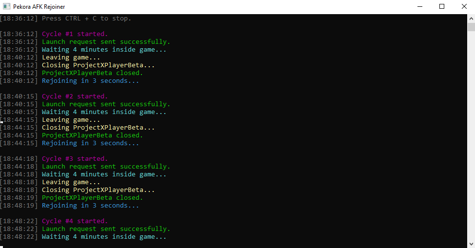

# Pekora AFK Rejoiner

Automatically joins a Pekora game, waits for a configurable amount of time, leaves, and rejoins in a continuous loop.



## Features

* Automatic game joining
* Automatic game leaving
* Automatic rejoining
* Timestamped logging
* Colorized console output
* Custom launch URL support
* Default game preset
* Lightweight and fast
* Built with C# and .NET 8

## Default Configuration

**Game:** Natural Disaster Survival 2021

**Place ID:** `338693`

The application includes a default Pekora launch URL but also allows custom launch URLs to be entered at startup.

## Requirements

* Windows 10/11
* .NET 8 Runtime or SDK
* Pekora Client installed
* Registered `pekora-player:` protocol handler

## Usage

1. Start the application.
2. Press **ENTER** to use the default game.
3. Or paste a custom Pekora launch URL.
4. The application will:

   * Launch Pekora
   * Stay in-game for 4 minutes
   * Close the client
   * Wait briefly
   * Rejoin automatically
5. Press **CTRL + C** to stop.

## Example Output

```text
[18:36:12] Cycle #1 started.
[18:36:12] Launch request sent successfully.
[18:36:12] Waiting 4 minutes inside game...
[18:40:12] Leaving game...
[18:40:12] Closing ProjectXPlayerBeta...
[18:40:12] ProjectXPlayerBeta closed.
[18:40:12] Rejoining in 3 seconds...
```

## Configuration

Modify these values inside `Program.cs`:

```csharp
private const int StayMinutes = 4;
private const int RejoinDelaySeconds = 8;
```

## Console Features

* Colored log messages
* ASCII startup banner
* Timestamped activity tracking
* Join / leave monitoring
* Error reporting

## Building

```bash
dotnet build -c Release
```

Release binaries will be generated in:

```text
bin/Release/net8.0/
```

## Disclaimer

This project is intended for personal automation, testing, and development purposes. Users are responsible for complying with any server rules, policies, or terms that apply to their environment.

## License

MIT License
